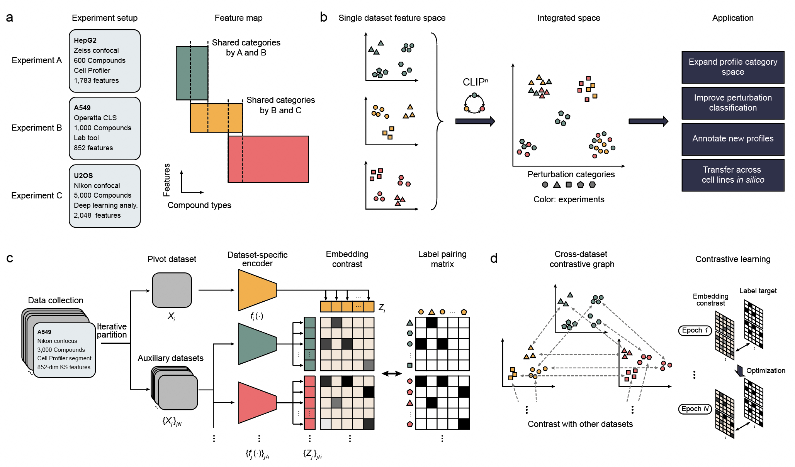
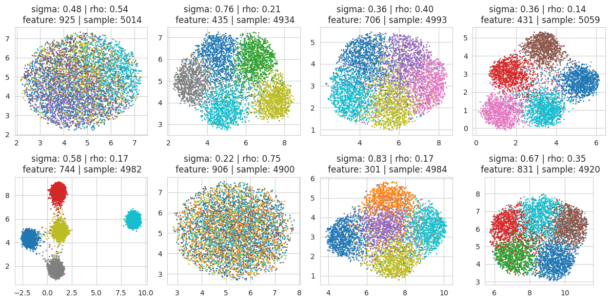
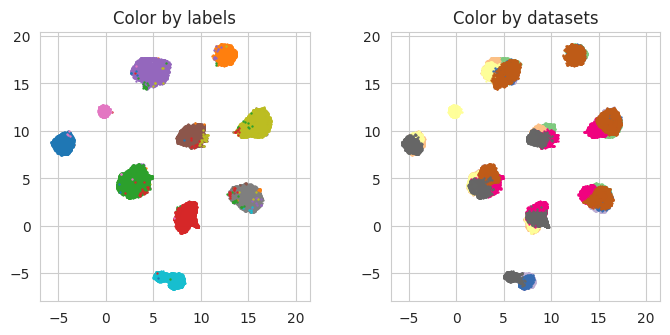

# Transitive prediction of small molecule function through alignment of high-content screening resources 

CLIP<sup>n</sup> is a Python package for integrating phenotypic screening data generated from diverse experimental setups. It provides tools for data
integration for reference compound profiles and predictions for uncharacterized compounds.

Published in [Nat Biotech 2025](https://doi.org/10.1038/s41587-025-02729-2)


****Figure 1***: ***(a)*** Examples of three distinct experiments profiled using different cell assays,
hardware/software
setups, and
resulting
feature maps. ***(b)*** Cartoon illustration depicting CLIP<sup>n</sup> integration and its applications. CLIP<sup>
n</sup> transforms diverse
phenotypic feature spaces into a unified integrated space, enabling accurate grouping of perturbation categories from
different experiments while separating distinct perturbations. The integrated space facilitates classification,
annotation, and profile transfer. ***(c)*** Model architecture of CLIP<sup>n</sup>. In each iteration, datasets are
partitioned into one
pivot dataset and multiple auxiliary datasets. Each dataset is then mapped to integrated embeddings through a
dataset-specific encoder. Embedding contrast matrices between pivot and auxiliary datasets are calculated and compared
with their perturbation similarities. ***(d)*** Construction of the cross-dataset contrastive graph by iteratively
selecting
each dataset as the pivot dataset. The entire contrastive graph is optimized together to reflect perturbation
categorical similarities between any two integrated datasets.*

## Key Features

1) **Profile**: integration can be performed directly from HCS datasets of different profiles (rather than raw images); 
2) **Drug category**: HCS profile datasets can be aligned even when the individual datasets utilize overlapping, but not identical reference compound categories with potentially different choices of compounds in these categories; 
3) **Datasets**: integration can be performed simultaneously on two or more datasets. 
## Prerequisites

Before you start using CLIP<sup>n</sup>, ensure that you have the following Python packages installed:

- `NumPy`
- `Torch`
- `tqdm`

CLIP<sup>n</sup> was developed using `Python 3.7.4` with `NumPy (1.21.6)`, `Torch (1.10.0)`, `tqdm (4.66.2)` packages
and tested
with `Ubuntu OS (20.04.6 LTS)`, `Nvidia Titan X GPU` and `Xeon E5 CPU`.

## Installation

You can install CLIP<sup>n</sup> via pip:

```bash
pip install clipn
```

## Getting Started

To start using CLIP<sup>n</sup>, import the package in your Python environment:

```python
from clipn import CLIPn
```

### Running the CLIP<sup>n</sup> Model

This guide will walk you through the process of running the CLIP<sup>n</sup> model on simulated data.

### Prerequisites

Ensure that you have the following Python packages installed:

- `functions.simulation`
- `matplotlib`
- `clipn`
- `umap`

### Steps

1. **Generate Simulation Data**

   Use the `assay_simulator` function from the `functions.simulation` module to generate the simulation data. The
   function takes several parameters such as the number of samples, clusters, assays, and others.

   ```python
   n_datasets = 8
   data = simulation.assay_simulator(n_sample=10000, n_cluster=10, n_assay=n_datasets,
                                     sigma_max=1, sigma_min=0.1,
                                     rho_max=0.8, rho_min=0.1,
                                     cluster_observe_ratio=0.5, random_seed=2023)
   X = dict()
   y = dict()
   for i in range(n_datasets):
       X[i] = data["dataset_" + str(i) + "_feature"]
       y[i] = data["dataset_" + str(i) + "_label"]
   ```

2. **Visualize the Simulation Data**

   You can visualize the simulation data using UMAP and matplotlib.
   <p align="center">
   
   <br>
   <em><strong>Figure 2</strong>: Visualization of simulation data</em>
   </p>


3. **Run CLIP<sup>n</sup> on the Generated Data**
   Instantiate the CLIP<sup>n</sup> model with the simulation data and the latent dimension. Then, fit the model with
   the data and predict the latent representations.

   ```
   Input: 
       X: python dictionary of features matrices from all datasets
       y: python dictionary of labels from all datasets
       latent_dim: number of latent dimensions
       
   ```

   ```python
   latent_dim = 10
   clipn = CLIPn(X, y, latent_dim=latent_dim)
   loss = clipn.fit(X, y)
   Z = clipn.predict(X)
   ```

   ```
   Output:
     Z: python dictionary of latent representations from all datasets
   ```

4. **Visualize the Latent Representations**

   The output of `Z` is also in dictionary format correponding to the input `X`. You can visualize the latent
   representations using UMAP.

   ```python
   from functions.helper import *
 
   umap_scatter(Z, y)
   ```

<p align="center">

  <br>
  <em><strong>Figure 3</strong>: Latent Representations Visualization</em>
</p>

## Reproducing Results

Scripts to obtain main results from the paper be found in [`scripts`](scripts) directory. The scripts include:

- [Integration from simulated data.](scripts/Simulation)
- [Integration from multiple hypoxia screens.](scripts/Hypoxia)
- [Integration from curated compound screens across 20 years.](scripts/HCS_datasets)
- [Integration from transcript + image profiles.](scripts/Expression)

## Data Availability

The processed experimental data used in the study are available at [Zenodo](https://doi.org/10.5281/zenodo.13773116). 

## Citation
Bao, F., Li, L., Hammerlindl, H. et al. Transitive prediction of small-molecule function through alignment of high-content screening resources. Nat Biotechnol (2025). https://doi.org/10.1038/s41587-025-02729-2

## License

CLIP<sup>n</sup> is released under the MIT License. See the [LICENSE](LICENSE) file for details.


